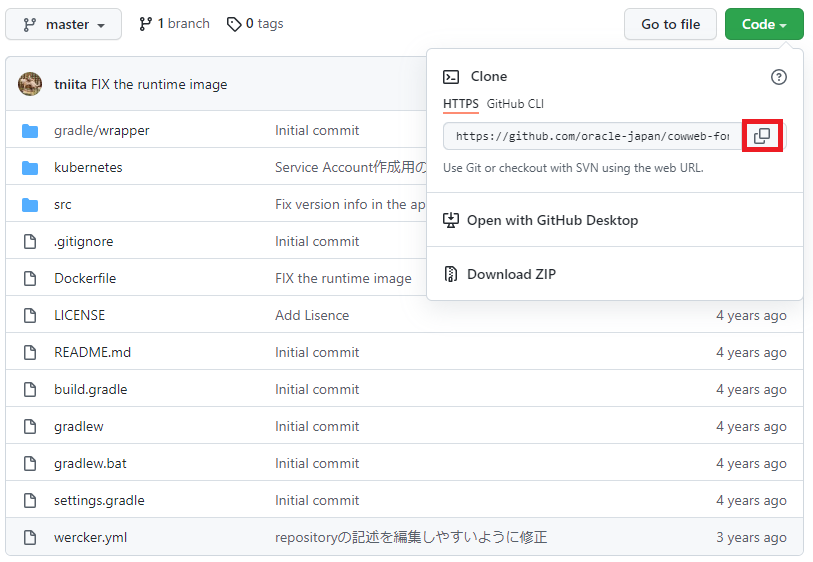
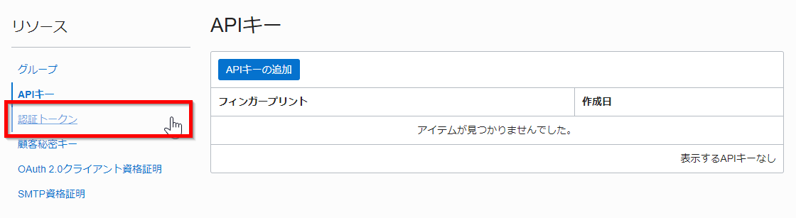
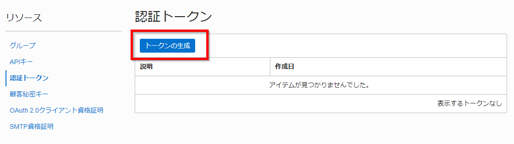
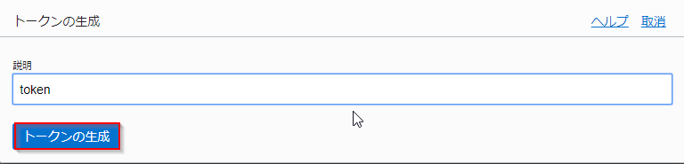
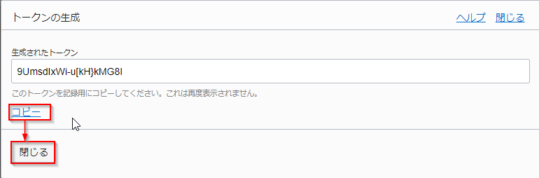
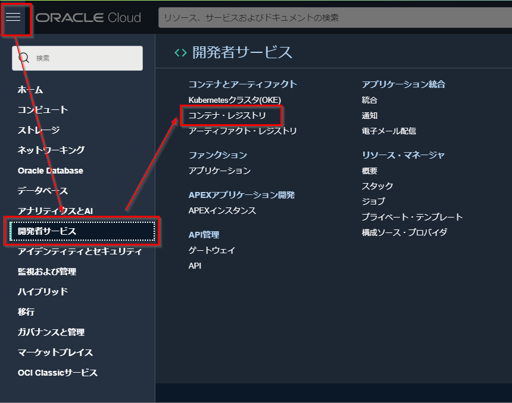
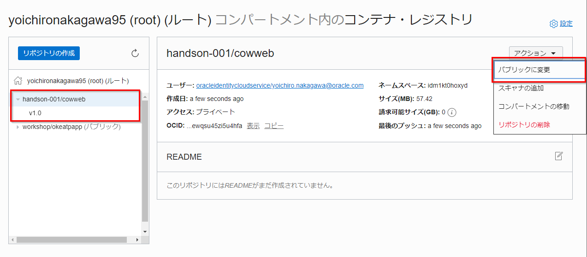

Oracle Container Engine for Kubernetes（以下简称 OKE）是 Oracle 的托管 Kubernetes 服务。
在本次动手实践中，您可以通过将示例应用程序部署到 OKE 的过程来学习 Kubernetes 本身的基本操作方法和特性。

此类别包括以下服务：

- 适用于 Kubernetes 的 Oracle 容器引擎 (OKE)：
：提供完全托管的 Kuberentes 集群的云服务。
- Oracle 云基础设施注册表 (OCIR)：
：提供完全托管的符合 Docker v2 标准的容器注册表的服务。

先决条件
--------

- 云环境
    * 必须拥有 Oracle 云帐户
    * 完成【OKE动手准备】(/ocitutorials/cloud-native/oke-for-commons/)

1.创建容器镜像
---------------------------------
在这里，我们将创建一个运行示例应用程序的容器映像。

### 1.1. 克隆源代码

这次使用的示例应用程序已创建为 oracle-japan GitHub 帐户下的存储库。

访问 [示例应用程序存储库](https://github.com/oracle-japan/cowweb-for-wercker-demo) 并单击“代码”按钮。

有两种方法可以获取源代码。一种是使用 git 客户端克隆，另一种是下载为 ZIP 文件。在这里，我们将使用前一个过程，因此在已展开的气球形对话框中单击 URL 字符串右侧的剪贴板图标。

这会将 URL 复制到剪贴板。



在 Cloud Shell 或 Linux 控制台中，执行以下命令以克隆源代码。

     git clone [复制仓库的 URL]

接下来，将克隆的目录设置为当前目录。

     cd cowweb-for-wercker-demo

### 1.2. 创建容器镜像
容器镜像由一个名为 Dockerfile 的文件定义，该文件描述了容器的配置。

示例应用程序的代码包含一个已经创建的 Dockerfile，所以让我们检查它的内容。 执行以下命令。

    cat Dockerfile

```dockerfile
# 1st stage, build the app
FROM maven:3.8.4-openjdk-17-slim as build

WORKDIR /helidon

# Create a first layer to cache the "Maven World" in the local repository.
# Incremental docker builds will always resume after that, unless you update
# the pom
ADD pom.xml .
RUN mvn package -Dmaven.test.skip -Declipselink.weave.skip

# Do the Maven build!
# Incremental docker builds will resume here when you change sources
ADD src src
RUN mvn package -DskipTests

RUN echo "done!"

# 2nd stage, build the runtime image
FROM openjdk:17-jdk-slim
WORKDIR /helidon

# Copy the binary built in the 1st stage
COPY --from=build /helidon/target/cowweb-helidon.jar ./
COPY --from=build /helidon/target/libs ./libs

CMD ["java", "-jar", "cowweb-helidon.jar"]

EXPOSE 8080
```

查看 Dockerfile 的内容，我们可以看到有两行以 FROM 开头。以 FROM 开头的前几行将示例应用程序的代码复制到安装了 jdk 的容器映像中，然后运行 ​​`mvn package` 来构建应用程序。

基于安装jdk的容器镜像，从以下FROM开始的一系列处理是创建应用执行用户，复制构建创建的jar文件，设置容器启动时执行的命令。增加。

现在使用这个 Dockerfile 创建一个容器镜像。执行以下命令。

    docker image build -t [存储库名称]/cowweb:v1.0 。

您可以在此命令中为 `repository name` 指定任何字符串，但通常以小写形式指定项目名称、用户名等。例如，命令将是：

    docker image build -t oke-handson/cowweb:v1.0 .

如果该过程以如下所示的 `Successfully tagged` 消息结束，则映像构建完成。

```
Sending build context to Docker daemon  128.5kB
Step 1/13 : FROM maven:3.8.4-openjdk-17-slim as build
Trying to pull repository docker.io/library/maven ... 
3.8.4-openjdk-17-slim: Pulling from docker.io/library/maven
f7a1c6dad281: Pull complete 
ea8366d5a4a5: Pull complete 
bff4abe573cd: Pull complete 
3f92e41bef06: Pull complete 
6581ea1ec5a5: Pull complete 
de879b0c951f: Pull complete 
ac1236d673e3: Pull complete 
Digest: sha256:150deb7b386bad685dcf0c781b9b9023a25896087b637c069a50c8019cab86f8
Status: Downloaded newer image for maven:3.8.4-openjdk-17-slim
 ---> 849a2a2d4242
Step 2/13 : WORKDIR /helidon
 ---> Running in 503337c170c7
Removing intermediate container 503337c170c7
 ---> e456a937870a
Step 3/13 : ADD pom.xml .
 ---> fadb77529253
Step 4/13 : RUN mvn package -Dmaven.test.skip -Declipselink.weave.skip
 ---> Running in 190344b19870

...（中略）...

Step 9/13 : WORKDIR /helidon
 ---> Running in ede9941ef284
Removing intermediate container ede9941ef284
 ---> ed9214bcc7e8
Step 10/13 : COPY --from=build /helidon/target/cowweb-helidon.jar ./
 ---> 72e6abc15a88
Step 11/13 : COPY --from=build /helidon/target/libs ./libs
 ---> 039c2d539641
Step 12/13 : CMD ["java", "-jar", "cowweb-helidon.jar"]
 ---> Running in b579e0845ce9
Removing intermediate container b579e0845ce9
 ---> 9344c0c557ac
Step 13/13 : EXPOSE 8080
 ---> Running in d19e9f20932b
Removing intermediate container d19e9f20932b
 ---> 5e997bb463db
Successfully built 5e997bb463db
Successfully tagged oke-handson/cowweb:v1.0
```

您可以使用 `docker image ls` 命令检查实际构建的图像。

    docker image ls

```
REPOSITORY           TAG                     IMAGE ID            CREATED             SIZE
oke-handson/cowweb   v1.0                    a328bfaffb52        4 minutes ago       428MB
<none>               <none>                  042346419526        5 minutes ago       505MB
openjdk              17-jdk-slim             37cb44321d04        4 months ago        408MB
maven                3.8.4-openjdk-17-slim   849a2a2d4242        5 months ago        425MB
```
你可以看到一个名为 `oke-handson/cowweb` 的图像已经被创建。

应用程序容器镜像使用安装了 maven 的容器用于构建源代码，使用安装了 openjdk 的容器用于应用程序执行环境。因此，您还会看到名称为 maven 和 openjdk 的图像。

这些容器会在构建应用程序的容器映像时自动下载和使用。

2.推送到OCIR并部署到OKE
-------------------------------------

### 2.1. 使用 OCIR 的提前准备
OCIR 是 Oracle 提供的容器注册管理服务。在这里，将 1.3. 中创建的容器镜像推送（上传）到 OCIR。

为了从 docker 命令访问 OCIR，我们将对 OCI 用户帐户进行必要的设置。

单击 OCI 控制台屏幕右上角的人形图标，然后从展开的配置文件中单击用户名 (oracleidentitycloudservice/<username>)。


向下滚动并单击左侧的“身份验证令牌”以移动到令牌创建屏幕。



单击“生成令牌”按钮。
    


在 [Geterate Token] 对话框中，输入描述令牌用途的信息（任意字符串），然后单击“Generate Token”按钮。


    
您将在对话框中看到生成的令牌。单击“复制”字符串会将此标记复制到剪贴板。然后点击“关闭”。



通过将其粘贴到文本编辑器等中来记下此标记，因为它将在后面的步骤中使用。

### 2.2. 将容器镜像推送到OCIR
现在将容器图像推送到 OCIR。

首先，使用 `docker login` 命令登录 OCIR。指定要登录的注册表时，您必须为托管数据中心区域指定适当的区域代码。

从下表中找到适合您环境的区域代码。

地区|地区代码
-|-
ap-tokyo-1|nrt
ap-osaka-1|kix
ap-melbourne-1|mel
us-ashburn-1|iad
us-phoenix-1|phx
ap-mumbai-1|bom
ap-seoul-1|icn
ap-sydney-1|syd
ca-toronto-1|yyz
ca-montreal-1|yul
eu-frankfurt-1|fra
eu-zurich-1|zrh
sa-saopaulo-1|gru
uk-london-1|lhr
sa-santiago-1|scl
ap-hyderabad-1|hyd
eu-amsterdam-1|ams
me-jeddah-1|jed
ap-chuncheon-1|yny
me-dubai-1|dxb
uk-cardiff-1|cwl
us-sanjose-1|sjc
接下来，检查对象存储命名空间以登录 OCIR。

要检查对象存储命名空间，请单击 OCI 控制台屏幕右上角的人形图标，然后从展开的配置文件中检查租户：<租户名称>。


检查租户信息中对象存储设置中的对象存储命名空间值。将该值复制并粘贴到文本文件中以记下它，因为它将在访问 OCIR 时使用。


**关于对象存储命名空间**
每个租户分配一个对象存储命名空间。它跨越一个区域内的所有隔间。任意字符串已设置且无法更改。
{: .notice--info}

接下来，使用以下命令登录 OCIR。
    docker login [地区代码].ocir.io

例如，如果您使用的是东京地区 (nrt)，请使用以下命令登录。

    docker login nrt.ocir.io

系统会提示您输入您的用户名和密码，因此请按如下方式输入。

- 用户名：[对象存储命名空间]/[用户名]（例如 nrzftilbveen/oracleidentitycloudservice/yoi.naka.0106@gmail.com）
- 密码：[在 2.1 中创建的令牌字符串。]

**密码**
请注意，您在此处输入的密码与您用于登录 OCI 控制台的密码不同。
{: .notice--警告}

如果您看到如下所示的“Login Succeeded”消息，则表示您已成功登录。

```
Username: nrzftilbveen/Handson-001
Password:
Login Succeeded
```

接下来，更新容器图像标签以匹配 OCIR 格式。运行 `docker tag` 命令。

    docker image tag [repository name]/cowweb:v1.0 [region code].ocir.io/object storage namespace]/[repository name]/cowweb:v1.0

指定与前面步骤中指定的相同的 [Region code] 和 [Object storage namespace]。对于存储库名称，请指定您在 `docker build` 期间所做的相同字符串。

例如：

    docker image tag  oke-handson/cowweb:v1.0 nrt.ocir.io/nrzftilbveen/oke-handson/cowweb:v1.0

此操作将指定推送目标注册表的信息添加到容器映像。如果您不这样做，容器映像将采用默认注册表并使用 Docker 提供的 Docker Hub 注册表。

现在我们准备好将图像实际推送到 OCIR。执行以下命令。

    docker image push [region code].ocir.io/[object storage namespace]/[repository name]/cowweb:v1.0

例如：

    docker image push nrt.ocir.io/nrzftilbveen/oke-handson/cowweb:v1.0

如果执行结果如下，则推送成功。

```
The push refers to repository [nrt.ocir.io/nrzftilbveen/oke-handson/cowweb]
d07a2053e8fb: Pushed
93ed7a751af8: Pushed
20dd87a4c2ab: Pushed
78075328e0da: Pushed
9f8566ee5135: Pushed
v1.0: digest: sha256:5769c194f3861f71c9fd43eb763813676aaba0b41acf453fb6a09a1af7525c82 size: 1367
```

**docker push时的行为**  
如果容器注册中心被多个用户在一个组上手等情况下共享，可能会出现以下消息。
```sh
60dc38cb0cd5: Layer already exists
ea75a4331573: Layer already exists
20dd87a4c2ab: Layer already exists
…
```
这是您在上传注册表中已存在的相同内容时看到的内容，因此您可以继续执行这些步骤。
<div class="notice--warning">
  {{ notice | markdownify }}
</div>
现在让我们确认容器存储在 OCIR 中。在 OCI 控制台屏幕上，展开左上角的菜单，然后单击 `Developer Services` - `Container Registry`。



将显示存储库列表。确保其中有一个具有指定名称的容器。

然后打开屏幕右上角的“Actions”菜单并单击“Change to Public”。



这样就完成了在 registry 中的容器镜像存储，但默认情况下，需要与推送时获取镜像时相同的身份验证信息。为了更容易与 Kubernetes 一起使用，请将存储库更改为 Public 并将其设置为无需身份验证即可获取图像。

这样就完成了容器镜像在 OCIR 中的存储。

### 2.3. 部署到 OKE
现在是时候将应用程序的容器部署到 OKE 集群了。

从 OKE 开始，为了将容器部署到 Kubernetes 集群，需要在名为 manifest 的文件中描述集群上的放置信息。

示例应用程序的代码包含一个已创建的清单文件，因此让我们检查其内容。执行以下命令。

```
cat ./kubernetes/cowweb.yaml
```
```sh
kind: Deployment
apiVersion: apps/v1
metadata:
  name: cowweb
spec:
  replicas: 2
  selector:
    matchLabels:
      app: cowweb
  template:
    metadata:
      labels:
        app: cowweb
        version: v1
    spec:
      containers:
        - name: cowweb
          image: ${region-code}.ocir.io/${tenancy}/${repository}/cowweb:v1.0
          imagePullPolicy: IfNotPresent
          ports:
            - name: api
              containerPort: 8080
    ...（以下略）...
```

此文件定义示例应用程序的容器在集群上的布局方式。比如第 6 行的描述 `replicas:2` 表示这个容器会被启动两次，并且有冗余配置。

**关于示例应用程序**
当容器实际在 Kubernetes 上运行时，它们在称为 Pod 的管理单元中执行。上面的清单将部署两个包含示例应用容器的 pod。
{: .notice--info}

第 22 行指定将在集群上实际运行的容器镜像。目前的描述不是根据自己的环境写的，所以请把这部分改成正确的值。具体请修改为与2.2中执行`docker image push`命令时指定的字符串相同的内容。

[区域代码].ocir.io/[对象存储命名空间]/[存储库名称]/cowweb:v1.0

例如，像这样的字符串：

     nrt.ocir.io/nrzftilbveen/oke-handson/cowweb:v1.0

接下来，让我们检查一下名为 cowweb-service.yaml 的清单文件的内容。

```
cat ./kubernetes/cowweb-service.yaml
```
```sh
kind: Service
apiVersion: v1
metadata:
  name: cowweb
  labels:
    app: cowweb
  annotations:
    oci.oraclecloud.com/load-balancer-type: "lb"
    service.beta.kubernetes.io/oci-load-balancer-shape: "flexible"
    service.beta.kubernetes.io/oci-load-balancer-shape-flex-min: "10"
    service.beta.kubernetes.io/oci-load-balancer-shape-flex-max: "30"
spec:
  type: LoadBalancer
  selector:
    app: cowweb
  ports:
    - port: 80
      targetPort: 8080
      name: http
```

此清单文件定义了接受集群请求流量的规则。描述 `type: LoadBalancer` 意味着我们将自动为托管集群的云服务提供负载均衡器，并将来自该 LB 的流量传递给容器。

让我们在 Kubernetes 上运行示例应用程序容器。首先，创建一个命名空间，这是一个通过将集群划分为分区来管理集群的区域。在下面的命令中，命名空间名称可以是任何字符串。
这一次，使用命名空间名称“handson”创建它。

    kubectl 创建命名空间handson

将默认命名空间更改为上面创建的命名空间。完成此操作后，您不必每次运行 kubectl 时都指定 Namespace。

    kubectl config set-context $(kubectl config current-context) --namespace=handson

接下来，将清单文件应用到您的集群并在您的集群中创建 Pod 和服务。

```
kubectl apply -f ./kubernetes/cowweb.yaml
```
```
kubectl apply -f ./kubernetes/cowweb-service.yaml
```

您可以通过运行以下命令检查资源配置是否完成：

     kubectl 获取 pod、服务

如果可以确认所有 Pod 的 STATUS 都是 Running 并且有一个名为 cowweb 的 Service，则资源创建完成（直到实际创建负载均衡器后才会显示 Service 的 EXTERNAL-IP。这种情况下，请稍等片刻，重新执行上述命令）。

```
NAME                          READY   STATUS    RESTARTS   AGE
pod/cowweb-695c65b665-sgcdk   1/1     Running   0          17s
pod/cowweb-695c65b665-vh825   1/1     Running   0          17s

NAME                 TYPE           CLUSTER-IP      EXTERNAL-IP       PORT(S)        AGE
service/cowweb       LoadBalancer   10.96.229.191   130.***.***.***   80:30975/TCP   1m
```

**关于集体动手时负载均衡器的形状**
当多个用户在集体动手等情况下共享一个云环境时，可能会达到负载均衡器可以使用的最大数量，无法正常创建一个Service。
在这种情况下，更改负载均衡器的形状（可以处理的流量）并尝试创建服务。
具体来说，执行以下命令。
```sh
# 删除创建的服务
kubectl delete -f ./kubernetes/cowweb-service.yaml
```
这是您在上传注册表中已存在的相同内容时看到的内容，因此您可以继续执行这些步骤。 
<div class="notice--warning">
  {{ notice | markdownify }}
</div>

**关于示例应用程序**
当容器实际在 Kubernetes 上运行时，它们在称为 Pod 的管理单元中执行。上面的清单将部署两个包含示例应用容器的 pod。
{: .notice--info}

在上面的示例中，这意味着负载均衡器暴露在 IP 地址 130.***.***.*** 的 80 端口上，您可以通过在此处发送请求来访问应用程序。在文本编辑器等中记下此 IP 地址。

现在已经完成了集群的部署，让我们实际检查一下操作。执行以下命令。

    curl "http://[负载均衡器 IP]/cowsay/say"

如果显示以下 ASCII 艺术，则应用程序正常工作，就像我在本地检查操作时一样。

```
 ______
< Moo! >
 ------
        \   ^__^
         \  (oo)\_______
            (__)\       )\/\
                ||--WWW |
                ||     ||
```

恭喜。现在您的 OKE 集群上运行了一个工作应用程序！

3. 在 Kubernetes 上确认对象
------------------------------
从这里，我们将在使用我们刚刚部署的示例应用程序检查 Kubernetes 上的对象时查看 Kubernetes 的基本功能。
首先，从存款。

### 3.1. 检查部署对象
Deployment 是一个对象，它定义了你要运行的容器相关的配置信息，例如 Pod 副本的数量（冗余配置中的 Pod 数量）和 Pod 包含的容器的规范。
到目前为止，我们已经在集群上创建了一个 Deployment 对象，它允许示例应用程序在集群上运行。

现在让我们检查一下 Deployment 对象中的信息。执行以下命令以获取集群中存在的 Deployment 列表。

```
kubectl get deployments
```
```
NAME     READY   UP-TO-DATE   AVAILABLE   AGE
cowweb   2/2     2            2           3m53s
```

可以看到有一个我们之前创建的名为 cowweb 的 Deployment。 DESISRED、CURRENT 等的值为 2 表示指定两个 Pod 移动，并且 Pod 正在按指定移动。

要了解有关此部署的更多信息，请运行以下命令：

```
kubectl describe deployments/cowweb
```
```
Name:               cowweb
Namespace:          handson-030
CreationTimestamp:  Thu, 31 Jan 2019 17:34:44 +0000
Labels:             <none>
Annotations:        deployment.kubernetes.io/revision: 1
...（中略）...
NewReplicaSet:   cowweb-57885b669c (2/2 replicas created
Events:
  Type    Reason             Age   From                   Messag
  ----    ------             ----  ----                   ------
  Normal  ScalingReplicaSet  23m   deployment-controller  Scaled up replica set cowweb-57885b669c to 2
```

您将看到有关此部署的大量信息，但最常被引用的是您将在最后一个事件下方看到的内容。

这是该 Pod 过去发生的事件的记录，对于故障排除线索（例如 Pod 无法正常启动）特别有用。

### 3.2. 查看 Pod 标准输出
现在让我们看一下 Pod 对象。
首先，通过显示标准输出检查 Pod 信息。
检查 Kubernetes 上运行的应用程序运行状态的最简单方法是检查 Pod 的标准输出。要查看 Pod 的标准输出，请运行以下命令：

    kubectl 日志 [Pod 名称]

对于此处指定的 Pod 名称，指定通过显示 Pod 列表显示的两个 Pod 之一。

```
kubectl get pods
```
```
NAME                      READY   STATUS    RESTARTS   AGE
cowweb-57885b669c-9dzg4   1/1     Running   0          43m
cowweb-57885b669c-r7l4g   1/1     Running   0          43m
```

例如，在这种情况下，命令将是：

```
kubectl logs cowweb-57885b669c-9dzg4
```
```
...（中略）...
2022.08.25 05:09:44 INFO com.oracle.jp.cowweb.CowsayResource Thread[helidon-server-1,5,server]: I'm working...

2022.08.25 05:09:44 INFO com.oracle.jp.cowweb.CowsayResource Thread[helidon-server-2,5,server]: I'm working...

2022.08.25 05:09:49 INFO com.oracle.jp.cowweb.CowsayResource Thread[helidon-server-3,5,server]: I'm working...

2022.08.25 05:09:49 INFO com.oracle.jp.cowweb.CowsayResource Thread[helidon-server-4,5,server]: I'm working...

2022.08.25 05:09:54 INFO com.oracle.jp.cowweb.CowsayResource Thread[helidon-server-1,5,server]: I'm working...
```

下面是显示 Pod 的 stdout 内容的结果： Kubernetes 会定期检查集群中运行的容器的健康状况。 在这个示例应用程序中，它是这样实现的，以便在收到生死监视请求时输出上述日志。

**容器应用生命周期监控**
容器的活性监测功能称为 livenessProbe。
支持以下三种方法作为确认生死的方法。

1) 向特定端点发送 HTTP GET 请求
2）执行给定的命令
3) 创建 TCP Socket 连接

在 Pod 启动时也会进行类似的检查，以检查容器启动状态。
支持的检查方式与 livenessProbe 相同，但称为 readinessProbe。
<div class="notice--info">
  {{ notice | markdownify }}
</div>

#### 3.2.1. 检查 Pod 环境变量
要检查 Pod 中设置的环境变量，您需要访问 Pod 并执行 `env` 命令。

首先，使用 ``kubectl exec`` 命令在 Pod 中执行任意命令。

    kubectl exec [pod 名称] -- [你要运行的命令]

如果你将 `env` 应用到 [你要执行的命令] 并执行它，它将在指定的 Pod 中被调用，你可以输出环境变量。

    kubectl exec [Pod 名称] -- env

你也可以使用 kubectl exec 进入 Pod 的 shell。

    kubectl exec -it [pod 名称] -- /bin/sh

**关于 `kubectl exec` 命令**
通过使用“kubectl exec”，您可以启动集群中的任何容器并使用该容器的外壳。此技术在故障排除情况下很有用。
例如，在无法按预期访问集群中运行的应用程序的情况下，从集群内执行 curl 以检查通信可以帮助隔离问题。
{: .notice--info}

4. 应用扩展
---------------------------------
现在，我们将通过指定 Deployment 的副本数来尝试扩展/扩展 Pod。

### 4.1. 向外扩展
通过指定 Deployment 的副本数量，您可以增加或减少它管理的 Pod 数量。

要更改副本数量，请使用“kubectl scale”命令。 通过如下执行，我们指示管理 cowweb Pod 的 Deployment 将副本数设置为 4。

    kubectl scale deployments/cowweb --replicas=4

显示 Pod 列表。

    kubectl get pods

然后可以看到配置了4个Pod。

    NAME                      READY   STATUS    RESTARTS   AGE
    cowweb-57885b669c-4h5l4   0/1     Running   0          7s
    cowweb-57885b669c-9dzg4   1/1     Running   0          1h
    cowweb-57885b669c-hxvpz   0/1     Running   0          7s
    cowweb-57885b669c-r7l4g   1/1     Running   0          1h

在上面的示例中，一些 Pod 处于启动状态。一段时间后，所有 Pod 的 STATUS 都会变为 Running。

### 4.2. Service 确认路由
此时，您的集群中部署了四个 cowweb pod。在这种状态下，让我们检查一下对 Pod 的访问是如何负载均衡的。

cowweb 有一种机制来通过指定环境变量的变量名来回答值。让我们看看负载均衡是如何工作的，使用它来响应 Pod 的主机名。

将查询``?say=HOSTNAME`` 添加到操作检查中执行的 curl 命令的 URL 中，并执行以下命令。

    curl "http://[负载均衡器 IP]/cowsay/say?say=HOSTNAME"

如果您多次重复此命令，您将看到每次返回不同的主机名。

```
 _________________________
< cowweb-57885b669c-r7l4g >
 -------------------------
        \   ^__^
         \  (oo)\_______
            (__)\       )\/\
                ||----w |
                ||     ||
```
```
 _________________________
< cowweb-57885b669c-hxvpz >
 -------------------------
        \   ^__^
         \  (oo)\_______
            (__)\       )\/\
                ||----w |
                ||     ||
```

### 4.3. 缩小
当然，也可以减少 pod 的数量。 您可以通过使用 ``kubectl scale`` 命令指定副本数来减少副本数，就像我们对横向扩展所做的那样。

或者，您可以通过在部署清单文件中指定较少数量的副本并将该清单应用于集群来执行相同的操作。

首次部署示例应用程序时使用的清单文件将 2 指定为副本数，因此让我们通过应用它从 4 扩展到 2。

     kubectl apply -f ./kubernetes/cowweb.yaml

当您显示 Pod 列表时，您可以看到它已减少到 2 个。

```
kubectl get pods
```
```
NAME                      READY   STATUS    RESTARTS   AGE
cowweb-57885b669c-9dzg4   1/1     Running   0          1h
cowweb-57885b669c-r7l4g   1/1     Running   0          1h
```

**关于放大/缩小**
在现实生活中，我们建议所有操作操作（如横向扩展/横向扩展）都是编辑清单并应用它的操作。通过在源代码控制系统中管理清单，可以将集群配置更改作为代码进行跟踪。
{: .notice--info}

5. Pod 自动恢复
-----------------
Kubernetes 有一个特性，当一个 Pod 因故障而宕机时，它会自动重启一个新的 Pod。

让我们通过删除 Pod 来创建一个与故障等效的情况，并检查它是如何自动恢复的。

要删除 pod，请运行以下命令：

    kubectl delete [Pod 名称]

例如，该命令如下所示（使用“kubectl get pods”命令检查实际的 Pod 名称）。

    kubectl delete pod cowweb-57885b669c-9dzg4

如果在此之后立即显示 pod 列表，您可以看到删除的 pod 没有 pod 名称，并且启动了一个具有新名称的 pod。

```
NAME                      READY   STATUS    RESTARTS   AGE
cowweb-57885b669c-5mgrb   0/1     Running   0          7s    <- 新たに起動したPod
cowweb-57885b669c-r7l4g   1/1     Running   0          1h
```

Deployment 对象将 Pod 的数量指定为 2。 当 Pod 被删除并成为一个时，Kubernetes 会检测到与指定数量的差异并自动启动 Pod。


本教程到此结束。
