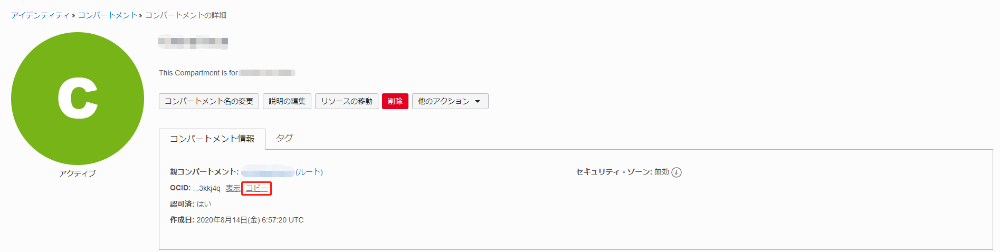
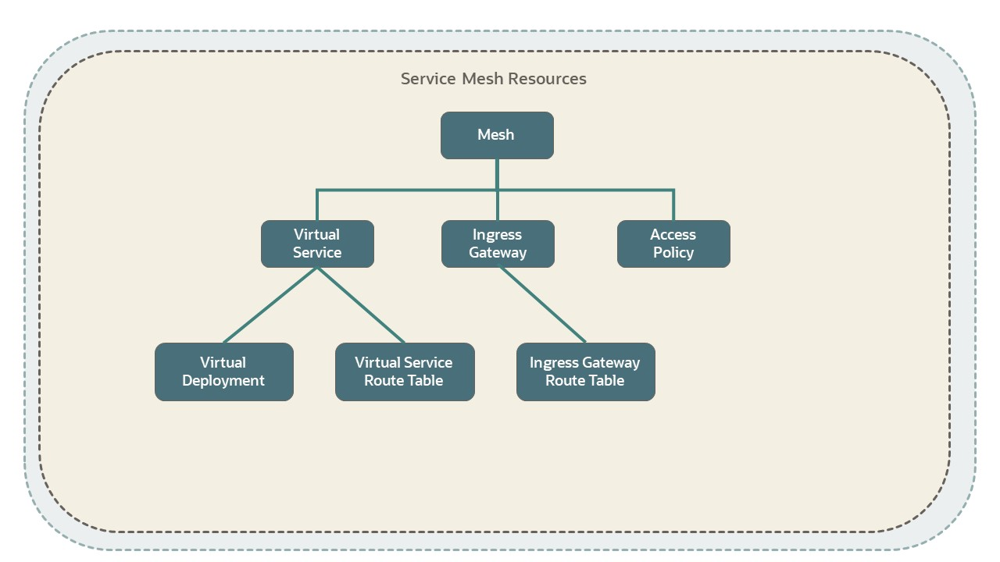
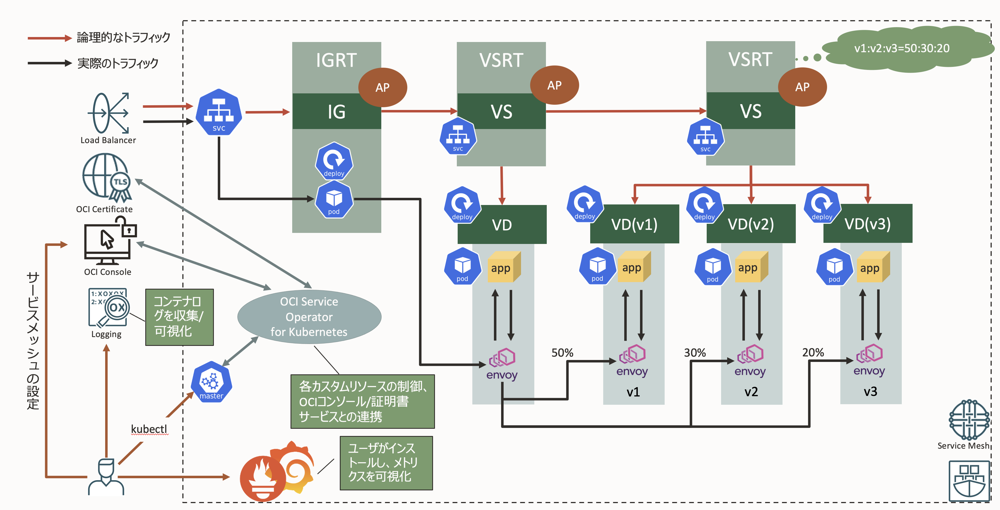
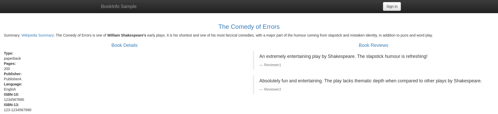
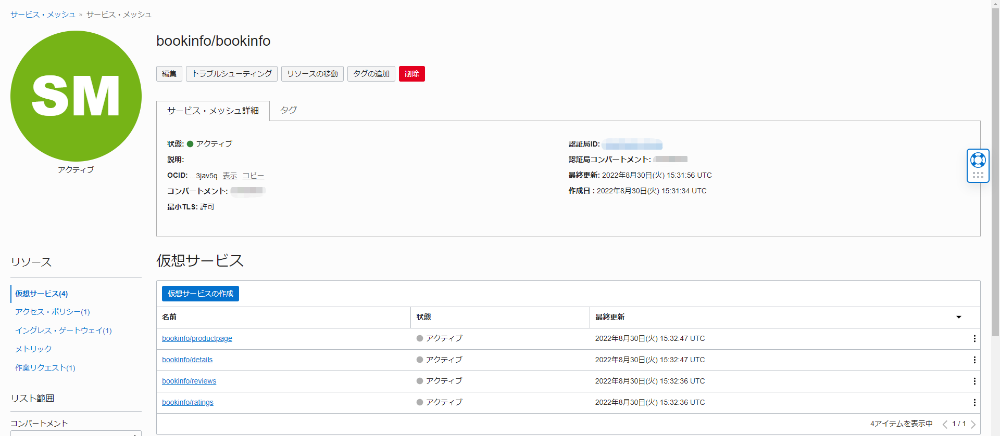
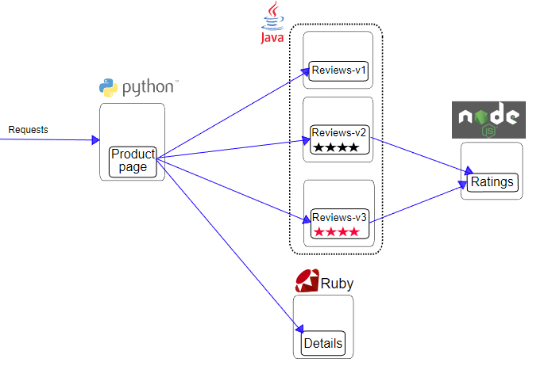

Oracle 云基础设施 (OCI) 服务网格是为您的应用程序提供安全性、流量控制和可观察性功能的基础设施层。
OCI Service Mesh 让开发和运维云原生应用变得简单。

在本教程中，我们会将 Bookinfo 应用程序部署到 Oracle Container Engine for Kubernetes (OKE) 集群。
接下来，将 OCI 服务网格添加到您的应用程序部署中。

##先决条件

- 云环境
  - 拥有甲骨文云账户

## 提前准备

首先，做以下准备工作。

- 1.搭建证书服务
  - 1-1.创建证书和证书颁发机构
  - 1-2.获取分区、证书颁发机构和证书的 OCID

- 2.创建动态组和策略
  - 创建与 OCI 服务网格和证书服务相关的动态组和策略

- 3. 构建 Oracle Container Engine for Kubernetes (OKE) 集群
  - 3-1.安装 OSOK (Oracle Service Operator for Kubernetes)
  - 3-2. 安装指标服务器

### 1.建筑证书服务

在这里，创建与 OCI 服务网格进行 TLS（传输层安全）通信所需的证书和证书颁发机构。

#### 1-1. 创建证书颁发机构和证书

请参阅 [此处](/ocitutorials/intermediates/certificate/) 以构建证书服务。

#### 1-2.获取分区、证书颁发机构和证书的 OCID

这里，隔间 OCID 和在 [1-1. 获取 OCID.

首先，获取隔间的 OCID。

在 OCI 控制台屏幕上，展开左上角的菜单，单击“Identity and Security”，然后单击“Compartments”。

将出现隔间列表，单击您的隔间。

当显示隔间详细信息时，单击 OCID 右侧的“复制”并记下隔间的 OCID。

另外，记下隔间名称。



接下来，获取证书颁发机构的 OCID。

在 OCI 控制台屏幕上，展开左上角的菜单，单击“Identity and Security”，然后单击“Certificate Authority”。

显示证书颁发机构列表，单击预先准备创建的证书颁发机构。

将显示 CA 的详细信息，单击 OCID 右侧的“复制”，并记下 CA 的 OCID。


然后获取证书的OCID。

在 OCI 控制台屏幕上，展开左上角的菜单，单击“身份和安全”，然后单击“证书”。

显示证书列表，单击预先创建的证书准备。

当显示证书的详细信息时，单击 OCID 右侧的“复制”并记下证书的 OCID。


这样就完成了隔离区、证书颁发机构和证书的 OCID 的获取。

### 2. 创建动态组和策略

我们现在将创建 OCI 服务网格所需的动态组和策略。

**关于动态组和策略**
Oracle Cloud Infrastrcture 具有动态组的概念。
有关动态组的详细信息，请参阅页面[此处](https://docs.oracle.com/ja-jp/iaas/Content/Identity/Tasks/managingdynamicgroups.htm)。
另外，配置的动态组可以通过策略实现基于OCI上的资源和实例的操作。
有关政策详情，请查看页面[此处](https://docs.oracle.com/ja-jp/iaas/Content/Identity/Concepts/policygetstarted.htm#Getting_Started_with_Policies)。
{: .notice--信息}

**关于策略设置**
本实践假设您拥有您的隔间的管理员权限（“管理隔间中的所有资源”）。
如果你在试用环境中，你不需要知道它，因为你有管理员权限。
{: .notice--警告}

在 OCI 控制台屏幕上，展开左上角的菜单，单击“身份和安全”，然后单击“创建动态组”。

创建动态组如下：

- 名称：`MeshDynamicGroup`
- 描述：`MeshDynamicGroup`
- 规则1：
  ```
  ANY {instance.compartment.id = '<在准备中获得的您的隔间的 OCID>'}
  ANY {resource.type='certificateauthority', resource.type='certificate'}
  ```

每个动态组的含义如下。

| 动态组 | 描述 |
| ---------------------------------------------- ---------------------------------- |
| ANY {instance.compartment.id = '<预先获得的你的隔离区的OCID>'} | 一条规则，表示隔离区中的所有实例 |
| ANY {resource.type='certificatauthority', resource.type='certificate'} | 暗示证书服务的规则 |

创建动态组后，创建策略。
在 OCI 控制台屏幕上，展开左上角的菜单，单击“身份和安全”，然后单击“策略”。

创建如下策略。

- 名称：`MeshPolicy`
- 描述：`MeshPolicy`
- 策略：
  ```
  Allow dynamic-group MeshDynamicGroup to use keys in compartment <您的隔间名称>
  Allow dynamic-group MeshDynamicGroup to manage objects in compartment <您的隔间名称>
  Allow dynamic-group MeshDynamicGroup to manage service-mesh-family in compartment <您的隔间名称>
  Allow dynamic-group MeshDynamicGroup to read certificate-authority-family in compartment <您的隔间名称>
  Allow dynamic-group MeshDynamicGroup to use certificate-authority-delegates in compartment <您的隔间名称>
  Allow dynamic-group MeshDynamicGroup to manage leaf-certificate-family in compartment <您的隔间名称>
  Allow dynamic-group MeshDynamicGroup to manage certificate-authority-associations in compartment <您的隔间名称>
  Allow dynamic-group MeshDynamicGroup to manage certificate-associations in compartment <您的隔间名称>
  Allow dynamic-group MeshDynamicGroup to manage cabundle-associations in compartment <您的隔间名称>
  ```

每个策略的含义如下。

  | 政策 | 说明  |
 | ----------------------------------------------------------------------------------------------------------------------------- |
 | Allow dynamic-group MeshDynamicGroup to use keys in compartment <您的隔间名称>                                  | 动态组在隔间中使用 OCI Vault 密钥的策略                  |
 | Allow dynamic-group MeshDynamicGroup to manage objects in compartment <您的隔间名称>                            | 用于动态组管理隔离区对象存储中数据的策略|
 | Allow dynamic-group MeshDynamicGroup to manage service-mesh-family in compartment <您的隔间名称>                | 动态组管理 OCI 服务网格的策略                                     |
 | Allow dynamic-group MeshDynamicGroup to read certificate-authority-family in compartment <您的隔间名称>         | 动态组使用证书服务证书颁发机构的策略                               |
 | Allow dynamic-group MeshDynamicGroup to use certificate-authority-delegates in compartment <您的隔间名称>       | 动态组在证书服务中使用每个证书颁发机构和证书的策略                     |
 | Allow dynamic-group MeshDynamicGroup to manage leaf-certificate-family in compartment <您的隔间名称>            | 用于管理证书服务中每个证书颁发机构和证书的动态组策略                    |
 | Allow dynamic-group MeshDynamicGroup to manage certificate-authority-associations in compartment <您的隔间名称> | 动态组管理证书服务中的证书颁发机构关联的策略                 |
 | Allow dynamic-group MeshDynamicGroup to manage certificate-associations in compartment <您的隔间名称>           | 用于管理证书服务证书关联的动态组策略                 |
 | Allow dynamic-group MeshDynamicGroup to manage cabundle-associations in compartment <您的隔间名称>              | 用于管理证书服务捆绑包关联的动态组策略               |

这样就完成了动态组和策略的创建。

### 3.搭建OKE集群

OKE集群搭建请参考[这里](https://oracle-japan.github.io/ocitutorials/cloud-native/oke-for-commons/)。

#### 3-1.安装OSOK

OCI Service Mesh 使用 [OSOK (Oracle Service Operator for Kubernetes)](https://github.com/oracle/oci-service-operator) 作为 Kubernetes Operator。

安装 OSOK 需要安装 Operator SDK 和 Operator Lifecycle Manager (OLM)。

安装 Operator SDK 和 Operator Lifecycle Manager (OLM) [此处](/ocitutorials/cloud-native/oke-for-intermediates/#3-1-operator-sdk%E3%81%8A%E3%82%88%E3%81%B3%E3%82%AA%E3%83%9A%E3%83%AC%E3%83%BC%E3%82%BF%E3%83%A9%E3%82%A4%E3%83%95%E3%82%B5%E3%82%A4%E3%82%AF%E3%83%AB%E3%83%9E%E3%83%8D%E3%83%BC%E3%82%B8%E3%83%A3olm%E3%81%AE%E3%82%A4%E3%83%B3%E3%82%B9%E3%83%88%E3%83%BC%E3%83%AB） . （链接目标的执行过程没有问题，只有`3-1`）

安装 Operator SDK 和 Operator Lifecycle Manager (OLM) 后，运行以下命令为 OSOK 创建命名空间。

```sh
kubectl create ns oci-service-operator-system
```

然后安装OSOK。

```sh
operator-sdk run bundle iad.ocir.io/oracle/oci-service-operator-bundle:1.1.0 -n oci-service-operator-system --timeout 5m
```

输出如下，安装OSOK。

```sh
INFO[0036] Successfully created registry pod: iad-ocir-io-oracle-oci-service-operator-bundle-X-X-X 
INFO[0036] Created CatalogSource: oci-service-operator-catalog 
INFO[0037] OperatorGroup "operator-sdk-og" created      
INFO[0037] Created Subscription: oci-service-operator-vX-X-X-sub 
INFO[0040] Approved InstallPlan install-tzk5f for the Subscription: oci-service-operator-vX-X-X-sub 
INFO[0040] Waiting for ClusterServiceVersion "oci-service-operator-system/oci-service-operator.vX.X.X" to reach 'Succeeded' phase 
INFO[0040]   Waiting for ClusterServiceVersion "oci-service-operator-system/oci-service-operator.vX.X.X" to appear 
INFO[0048]   Found ClusterServiceVersion "oci-service-operator-system/oci-service-operator.vX.X.X" phase: Pending 
INFO[0049]   Found ClusterServiceVersion "oci-service-operator-system/oci-service-operator.vX.X.X" phase: InstallReady 
INFO[0053]   Found ClusterServiceVersion "oci-service-operator-system/oci-service-operator.vX.X.X" phase: Installing 
INFO[0066]   Found ClusterServiceVersion "oci-service-operator-system/oci-service-operator.vX.X.X" phase: Succeeded 
INFO[0067] OLM has successfully installed "oci-service-operator.vX.X.X"
```

#### 3-2. 安装指标服务器

OCI Service Mesh 使用 HPA（Horizo​​ntal Pod Autoscaler）来缩放 Ingress Gateway（稍后介绍），因此安装一个 metrics server。

```嘘
kubectl apply -f https://github.com/kubernetes-sigs/metrics-server/releases/latest/download/high-availability.yaml
```

准备工作现已完成！

## 1.构建OCI服务网格

从这里开始，我们将最终开始构建 OCI Service Mesh。

总的来说，步骤如下：

- 1. OCI Service Mesh资源说明

- 2.部署示例应用

- 3.创建OCI Service Mesh资源

- 4.运行检查

### 1. OCI Service Mesh资源说明

首先查看OCI Service Mesh使用的资源。

如下图所示，OCI 服务网格是通过部署代理来实现的，每个微服务从托管控制平面接收配置信息。
Mesh 使用代理代表微服务发出入口和出站请求。
此配置启用服务网格的安全、流量控制和监控功能。入口网关资源管理进入网格的流量。


下图显示了基于部署在 OCI 服务网格上的 Bookinfo 应用程序（在本实践中使用）的每个资源。

入口流量通过入口网关和入口网关的路由表路由到“产品页面”服务。
评论服务的不同版本代表该服务的虚拟部署。为服务间通信的访问控制设置访问策略。


下图定义了 OCI 服务网格中资源之间的关系。 

简要描述每个资源。

- Mesh: 代表整个服务网格的资源
- Virtual Service: 服务网格中的虚拟服务
- Virtual Deployment: 链接到虚拟服务的虚拟部署
- Virtual Service Route Table: 虚拟服务中的流量规则。 存在就像 Istio 中的 Destination Rule。
- Ingress Gateway: 控制从网格外部到网格内部的通信的网关。 和 Istio 的 Ingress Gateway 几乎一样。
- Ingress Gateway Route Table: 入口网关流量规则。
- Access Policy: 虚拟服务的访问控制。

OCI Service Mesh 中还有其他资源，但上图仅选取了主要资源。

这是 OCI 服务网格资源的概述。
（图中有一些组件未在本实践中介绍，但将在中间部分和后面的部分中介绍。）



现在我们已经解释了各种资源，让我们构建 OCI 服务网格。

### 2. 部署示例应用程序（Bookinfo 应用程序）

这一次，我们将使用 Bookinfo 应用程序构建一个 Service Mesh 环境。

首先，让我们为 Bookinfo 应用程序创建一个命名空间。

```sh
kubectl create namespace bookinfo
```

接下来，给 bookinfo 命名空间一个启用 OCI 服务网格的标签。

```sh
kubectl label namespace bookinfo servicemesh.oci.oracle.com/sidecar-injection=enabled
```

部署 Bookinfo 应用程序。

```sh
kubectl apply -n bookinfo -f https://raw.githubusercontent.com/istio/istio/release-1.12/samples/bookinfo/platform/kube/bookinfo.yaml
```

示例应用程序的部署已完成。

### 3.创建OCI服务网格资源

接下来，我们将创建资源来配置 OCI 服务网格。

此外，应用程序的主机名在清单中定义，但这次将是 `service-mesh.oracle.com`。
稍后编辑主机文件。

创建 Manifest`bookinfo_mesh.yaml` 以创建 OCI 服务网格资源。
将以下信息设置为环境功能。
此信息收集于[1-2. 获取隔离区、CA 和证书的 OCID]（#1-2 获取隔离区 CA 证书的 ocid）。

- YOUR_COMPARTMENT_OCID：替换为你提前准备好的你的compartment的OCID。
- YOUR_CERTIFICATE_AUTHORITY_OCID：替换为事先获得的认证机构的OCID。
- YOUR_CERTIFICATE_OCID：替换为提前准备的证书的OCID。

```sh
YOUR_COMPARTMENT_OCID=ocid1.compartment.oc1..xxxxxxxxxx
YOUR_CERTIFICATE_AUTHORITY_OCID=ocid1.certificateauthority.oc1.xxxxxxxxxx
YOUR_CERTIFICATE_OCID=ocid1.certificate.oc1.xxxxxxxxxx
```

创建“bookinfo_mesh.yaml”。

```yaml
cat > bookinfo_mesh.yaml << EOF
---
kind: Mesh
apiVersion: servicemesh.oci.oracle.com/v1beta1
metadata:
  name: bookinfo
  namespace: bookinfo
spec:
  compartmentId: $YOUR_COMPARTMENT_OCID
  certificateAuthorities:
    - id: $YOUR_CERTIFICATE_AUTHORITY_OCID
  mtls:
    minimum: PERMISSIVE
---
##################################################################################################
# Details service
##################################################################################################
kind: VirtualService
apiVersion: servicemesh.oci.oracle.com/v1beta1
metadata:
  name: details
  namespace: bookinfo
spec:
  mesh:
    ref:
      name: bookinfo
  defaultRoutingPolicy:
    type: UNIFORM
  compartmentId: $YOUR_COMPARTMENT_OCID
  hosts:
    - details
    - details:9080
---
kind: VirtualDeployment
apiVersion: servicemesh.oci.oracle.com/v1beta1
metadata:
  name: details-v1
  namespace: bookinfo
spec:
  virtualService:
    ref:
      name: details
  compartmentId: $YOUR_COMPARTMENT_OCID
  listener:
    - port: 9080
      protocol: HTTP
  accessLogging:
    isEnabled: true
  serviceDiscovery:
    type: DNS
    hostname: details
---
apiVersion: servicemesh.oci.oracle.com/v1beta1
kind: VirtualServiceRouteTable
metadata:
  name: details-route-table
  namespace: bookinfo
spec:
  compartmentId: $YOUR_COMPARTMENT_OCID
  virtualService:
    ref:
      name: details
  routeRules:
    - httpRoute:
        destinations:
          - virtualDeployment:
              ref:
                name: details-v1
            weight: 100
---
##################################################################################################
# Ratings service
##################################################################################################
kind: VirtualService
apiVersion: servicemesh.oci.oracle.com/v1beta1
metadata:
  name: ratings
  namespace: bookinfo
spec:
  mesh:
    ref:
      name: bookinfo
  defaultRoutingPolicy:
    type: UNIFORM
  compartmentId: $YOUR_COMPARTMENT_OCID
  hosts:
    - ratings
    - ratings:9080
---
kind: VirtualDeployment
apiVersion: servicemesh.oci.oracle.com/v1beta1
metadata:
  name: ratings-v1
  namespace: bookinfo
spec:
  virtualService:
    ref:
      name: ratings
  compartmentId: $YOUR_COMPARTMENT_OCID
  listener:
    - port: 9080
      protocol: HTTP
  accessLogging:
    isEnabled: true
  serviceDiscovery:
    type: DNS
    hostname: ratings
---
apiVersion: servicemesh.oci.oracle.com/v1beta1
kind: VirtualServiceRouteTable
metadata:
  name: ratings-route-table
  namespace: bookinfo
spec:
  compartmentId: $YOUR_COMPARTMENT_OCID
  virtualService:
    ref:
      name: ratings
  routeRules:
    - httpRoute:
        destinations:
          - virtualDeployment:
              ref:
                name: ratings-v1
            weight: 100
---
##################################################################################################
# Reviews service
##################################################################################################
kind: VirtualService
apiVersion: servicemesh.oci.oracle.com/v1beta1
metadata:
  name: reviews
  namespace: bookinfo
spec:
  mesh:
    ref:
      name: bookinfo
  defaultRoutingPolicy:
    type: UNIFORM
  compartmentId: $YOUR_COMPARTMENT_OCID
  hosts:
    - reviews
    - reviews:9080
---
kind: VirtualDeployment
apiVersion: servicemesh.oci.oracle.com/v1beta1
metadata:
  name: reviews-v1
  namespace: bookinfo
spec:
  virtualService:
    ref:
      name: reviews
  compartmentId: $YOUR_COMPARTMENT_OCID
  listener:
    - port: 9080
      protocol: HTTP
  accessLogging:
    isEnabled: true
  serviceDiscovery:
    type: DNS
    hostname: reviews
---
kind: VirtualDeployment
apiVersion: servicemesh.oci.oracle.com/v1beta1
metadata:
  name: reviews-v2
  namespace: bookinfo
spec:
  virtualService:
    ref:
      name: reviews
  compartmentId: $YOUR_COMPARTMENT_OCID
  listener:
    - port: 9080
      protocol: HTTP
  accessLogging:
    isEnabled: true
  serviceDiscovery:
    type: DNS
    hostname: reviews
---
kind: VirtualDeployment
apiVersion: servicemesh.oci.oracle.com/v1beta1
metadata:
  name: reviews-v3
  namespace: bookinfo
spec:
  virtualService:
    ref:
      name: reviews
  compartmentId: $YOUR_COMPARTMENT_OCID
  listener:
    - port: 9080
      protocol: HTTP
  accessLogging:
    isEnabled: true
  serviceDiscovery:
    type: DNS
    hostname: reviews
---
apiVersion: servicemesh.oci.oracle.com/v1beta1
kind: VirtualServiceRouteTable
metadata:
  name: reviews-route-table
  namespace: bookinfo
spec:
  compartmentId: $YOUR_COMPARTMENT_OCID
  virtualService:
    ref:
      name: reviews
  routeRules:
    - httpRoute:
        destinations:
          - virtualDeployment:
              ref:
                name: reviews-v1
            weight: 50
          - virtualDeployment:
              ref:
                name: reviews-v2
            weight: 25
          - virtualDeployment:
              ref:
                name: reviews-v2
            weight: 25
---
##################################################################################################
# Productpage services
##################################################################################################
kind: VirtualService
apiVersion: servicemesh.oci.oracle.com/v1beta1
metadata:
  name: productpage
  namespace: bookinfo
spec:
  mesh:
    ref:
      name: bookinfo
  defaultRoutingPolicy:
    type: UNIFORM
  compartmentId: $YOUR_COMPARTMENT_OCID
  hosts:
    - productpage
    - productpage:9080
---
kind: VirtualDeployment
apiVersion: servicemesh.oci.oracle.com/v1beta1
metadata:
  name: productpage
  namespace: bookinfo
spec:
  virtualService:
    ref:
      name: productpage
  compartmentId: $YOUR_COMPARTMENT_OCID
  listener:
    - port: 9080
      protocol: HTTP
  accessLogging:
    isEnabled: true
  serviceDiscovery:
    type: DNS
    hostname: productpage
---
apiVersion: servicemesh.oci.oracle.com/v1beta1
kind: VirtualServiceRouteTable
metadata:
  name: productpage-route-table
  namespace: bookinfo
spec:
  compartmentId: $YOUR_COMPARTMENT_OCID
  virtualService:
    ref:
      name: productpage
  routeRules:
    - httpRoute:
        destinations:
          - virtualDeployment:
              ref:
                name: productpage
            weight: 100
---
kind: IngressGateway
apiVersion: servicemesh.oci.oracle.com/v1beta1
metadata:
  name: bookinfo-ingress-gateway
  namespace: bookinfo
spec:
  compartmentId: $YOUR_COMPARTMENT_OCID
  mesh:
    ref:
      name: bookinfo
  hosts:
    - name: bookinfoHost
      hostnames:
        - service-mesh.oracle.com
      listeners:
        - port: 9080
          protocol: HTTP
          tls:
            serverCertificate:
              ociTlsCertificate:
                certificateId: $YOUR_CERTIFICATE_OCID
            mode: TLS
  accessLogging:
    isEnabled: true
---
apiVersion: servicemesh.oci.oracle.com/v1beta1
kind: IngressGatewayRouteTable
metadata:
  name: bookinfo-ingress-gateway-route-table
  namespace: bookinfo
spec:
  compartmentId: $YOUR_COMPARTMENT_OCID
  ingressGateway:
    ref:
      name: bookinfo-ingress-gateway
  routeRules:
    - httpRoute:
        ingressGatewayHost:
          name: bookinfoHost
        destinations:
          - virtualService:
              ref:
                name: productpage
---
kind: AccessPolicy
apiVersion: servicemesh.oci.oracle.com/v1beta1
metadata:
  name: bookinfo-policy
  namespace: bookinfo
spec:
  mesh:
    ref:
      name: bookinfo
  compartmentId: $YOUR_COMPARTMENT_OCID
  rules:
    - action: ALLOW
      source:
        virtualService:
          ref:
            name: productpage
      destination:
        virtualService:
          ref:
            name: details
    - action: ALLOW
      source:
        virtualService:
          ref:
            name: productpage
      destination:
        virtualService:
          ref:
            name: reviews
    - action: ALLOW
      source:
        virtualService:
          ref:
            name: reviews
      destination:
        virtualService:
          ref:
            name: ratings
    - action: ALLOW
      source:
        ingressGateway:
          ref:
            name: bookinfo-ingress-gateway
      destination:
        virtualService:
          ref:
            name: productpage
---
EOF
```

接下来，创建 binding.yaml 以绑定在上面的清单中创建的 VirtualDeployment 和 Virtual Service。

在【1.OCI Service Mesh资源解释】（#1oci-service-mesh资源解释）中解释的资源中有没有出现名为`~Binding`的资源，但是`VirtualDeployment`和`Virtual如果你是没有问题的有一个“绑定”服务的资源图像。

创建 `binding.yaml`。

```yaml
cat > binding.yaml << EOF
kind: VirtualDeploymentBinding
apiVersion: servicemesh.oci.oracle.com/v1beta1
metadata:
  name: details-binding
  namespace: bookinfo
spec:
  virtualDeployment:
    ref:
      name: details-v1
      namespace: bookinfo
  target:
    service:
      ref:
        name: details
        namespace: bookinfo
---
kind: VirtualDeploymentBinding
apiVersion: servicemesh.oci.oracle.com/v1beta1
metadata:
  name: ratings-v1-binding
  namespace: bookinfo
spec:
  virtualDeployment:
    ref:
      name: ratings-v1
      namespace: bookinfo
  target:
    service:
      ref:
        name: ratings
        namespace: bookinfo
      matchLabels:
        version: v1
---
kind: VirtualDeploymentBinding
apiVersion: servicemesh.oci.oracle.com/v1beta1
metadata:
  name: reviews-v1-binding
  namespace: bookinfo
spec:
  virtualDeployment:
    ref:
      name: reviews-v1
      namespace: bookinfo
  target:
    service:
      ref:
        name: reviews
        namespace: bookinfo
      matchLabels:
        version: v1
---
kind: VirtualDeploymentBinding
apiVersion: servicemesh.oci.oracle.com/v1beta1
metadata:
  name: reviews-v2-binding
  namespace: bookinfo
spec:
  virtualDeployment:
    ref:
      name: reviews-v2
      namespace: bookinfo
  target:
    service:
      ref:
        name: reviews
        namespace: bookinfo
      matchLabels:
        version: v2
---
kind: VirtualDeploymentBinding
apiVersion: servicemesh.oci.oracle.com/v1beta1
metadata:
  name: reviews-v3-binding
  namespace: bookinfo
spec:
  virtualDeployment:
    ref:
      name: reviews-v3
      namespace: bookinfo
  target:
    service:
      ref:
        name: reviews
        namespace: bookinfo
      matchLabels:
        version: v3
---
kind: VirtualDeploymentBinding
apiVersion: servicemesh.oci.oracle.com/v1beta1
metadata:
  name: productpage-binding
  namespace: bookinfo
spec:
  virtualDeployment:
    ref:
      name: productpage
      namespace: bookinfo
  target:
    service:
      ref:
        name: productpage
        namespace: bookinfo
---
EOF
```
接下来，创建“service.yaml”，这是用于创建入口网关资源的清单。

这里再说一遍，有一个名为`IngressGatewayDeployment`的资源在[1.OCI Service Mesh资源解释](#1oci-service-mesh资源解释)中没有解释，但是它是像proxy这样的镜像，如果你是没有问题的能够。
（如果你了解 Istio，它就相当于 Envoy）

创建“service.yaml”。

```yaml
cat > service.yaml << EOF
apiVersion: servicemesh.oci.oracle.com/v1beta1
kind: IngressGatewayDeployment
metadata:
  name: bookinfo-ingress-gateway-deployment
  namespace: bookinfo
spec:
  ingressGateway:
    ref:
      name: bookinfo-ingress-gateway
      namespace: bookinfo
  deployment:
    autoscaling:
      minPods: 1
      maxPods: 1
  ports:
    - protocol: TCP
      port: 9080
      serviceport: 443
  service:
    type: ClusterIP
---
apiVersion: v1
kind: Service
metadata:
  name: bookinfo-ingress
  namespace: bookinfo
  annotations:
    service.beta.kubernetes.io/oci-load-balancer-shape: "flexible"
    service.beta.kubernetes.io/oci-load-balancer-shape-flex-min: "10"
    service.beta.kubernetes.io/oci-load-balancer-shape-flex-max: "100"
spec:
  ports:
    - port: 80
      targetPort: 9080
      name: http
    - port: 443
      targetPort: 9080
      name: https
  selector:
    servicemesh.oci.oracle.com/ingress-gateway-deployment: bookinfo-ingress-gateway-deployment
  type: LoadBalancer
EOF
```

然后，按顺序应用创建的清单。

```sh
kubectl apply -f bookinfo_mesh.yaml
kubectl apply -f binding.yaml
kubectl apply -f service.yaml
```
这样就完成了OCI Service Mesh环境的搭建。

### 4.运行检查

最后，检查操作。

确保所有 Pod 都在运行。

```sh
$ kubectl get pods -n bookinfo
NAME                                                              READY   STATUS    RESTARTS   AGE
bookinfo-ingress-gateway-deployment-deployment-595f7d5bc5-fqrbf   1/1     Running   0          23s
details-v1-586577784f-bp9dd                                       2/2     Running   0          4m41s
productpage-v1-589b848cc9-2zsw6                                   2/2     Running   0          4m38s
ratings-v1-679fc7b4f-stnk9                                        2/2     Running   0          4m30s
reviews-v1-7b76665ff9-2xvrh                                       2/2     Running   0          4m40s
reviews-v2-6b86c676d9-r2j6x                                       2/2     Running   0          4m39s
reviews-v3-b77c579-69pkq                                          2/2     Running   0          4m38s
```

要访问应用程序，我们将使用入口网关（实际上是 OCI LoadBalancer），因此请使用以下命令检查 IP 地址。

```sh
$ kubectl get svc -n bookinfo
NAME                                          TYPE           CLUSTER-IP      EXTERNAL-IP     PORT(S)                      AGE
bookinfo-ingress                              LoadBalancer   10.96.213.172   xxx.xxx.xxx.xxx 80:31700/TCP,443:31248/TCP   2m51s
bookinfo-ingress-gateway-deployment-service   ClusterIP      10.96.14.228    <none>          443/TCP                      2m51s
details                                       ClusterIP      10.96.174.202   <none>          9080/TCP                     13m
productpage                                   ClusterIP      10.96.222.216   <none>          9080/TCP                     13m
ratings                                       ClusterIP      10.96.120.160   <none>          9080/TCP                     13m
reviews                                       ClusterIP      10.96.22.199    <none>          9080/TCP                     13m
```

`bookinfo-ingress` 中显示的 `EXTERNAL-IP` (`xxx.xxx.xxx.xxx`) 将是 LoadBalancer IP 地址。

这次，我们要通过`https://service-mesh.oracle.com`访问，所以在本地的hosts文件中添加如下一行。

```
xxx.xxx.xxx.xxx service-mesh.oracle.com
```

现在访问`https://service-mesh.oracle.com/productpage`，如果出现如下画面，则表示成功！



此外，从 OCI 控制台查看时，您可以确认各种资源已使用 OSOK 创建。
在 OCI 控制台中，展开左上角的菜单，单击“Developer Services”，然后单击“Service Mesh”。

此外，如果您从 OCI 控制台创建或更改资源，OSOK 会将它们反映在 OKE 集群中。


这样就完成了OCI Service Mesh的搭建。

## Bookinfo 应用描述（可选）

Bookinfo 应用程序作为开源服务网格平台“Istio”项目的一部分进行分发。
显示有关书籍的信息，类似于在线书店中的单个目录条目。
该应用程序的页面显示图书描述、图书详细信息（ISBN、页数等）和一些图书评论。

应用程序的整体形象如下所示：



它分为四个独立的微服务：

- `productpage`：调用 `details` 和 `reviews` 微服务来为前端页面提供服务。
- `details`：提供书籍信息。
- `reviews`：提供书评。它还调用“评级”微服务。 （见下文）
- `ratings`：提供书评附带的评级（评分点）。

此外，“评论”微服务有三个版本。

- `ratings` 在版本 v1 中没有被调用。
- 版本 v2 调用“评级”并将每个评级显示为 1-5 颗黑色星星。
- 版本 v3 调用“评级”并将每个评级显示为 1-5 颗红星。

该应用程序是多语言的，这些服务独立于任何特定的服务网格平台。
